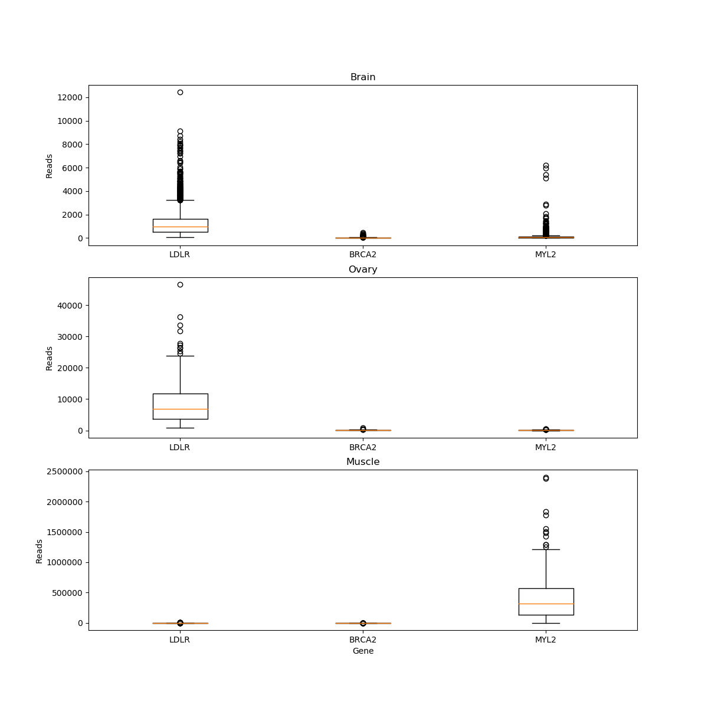

# workflow-sahu0957

This program generates gene expression boxplots from multiple tissues and data sets

## Installation
This program should be run in a conda environment. Install conda and its dependencies as follows:
```sh
wget https://repo.anaconda.com/miniconda/Miniconda3-latest-Linux-x86_64.sh
bash Miniconda3-latest-Linux-x86_64.sh -b
~/miniconda3/etc/profile.d/conda.sh
conda update --yes conda
conda config --add channels r
conda create --yes -n test
conda activate test
conda install -y pycodestyle
conda install --yes python=3.6
conda install matplotlib
```

## Running the Program
Specify genes of interest and tissues of interest in the Snakefile. In this case, I've used Brain, Ovary and Muscle tissues and LDLR, BRCA2, and MYL2 genes. Simply type snakemake in the terminal to generate the plot
```sh
snakemake
```


## Testing the Program
The files test_box.py, test_box.sh, test_get_tissue_samples.py, test_get_tissue_samples.sh, test_get_gene_counts.py, and test_get_gene_counts.sh are functional and unit tests for each script of the workflow. These are run automatically through Travis CI testing

## Release History
*1.0\
	*ADDED: Data and metadata fetching scripts, and boxplot generator\
	*ADDED: Functional and unit testing for the above scripts\
	*ADDED: CI through Travis\
	*ADDED: Workflow file (Snakefile) to integrate these scripts\
	*CHANGE: Updated all python code to PEP8 standards

## To Contribute
1. Fork it (< https://github.com/cu-swe4s-fall-2019/workflow-sahu0957.git>)
2. Create your feature branch (`git checkout -b feature_branch`)
3. Commit your changes (`git commit -m 'add your notes'`)
4. Push to the branch (`git push origin feature_branch`)
5. Create a new Pull request
"README.md" 99L, 4616C               
